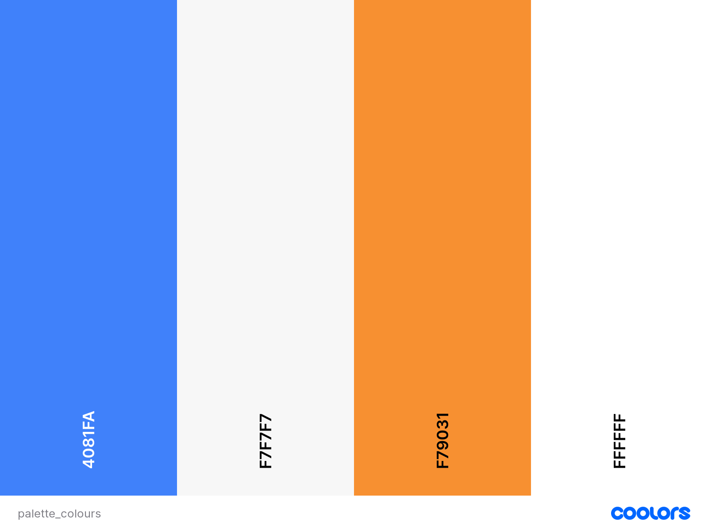

# Buy & Sell

Buy & Sell is an online platform designed for users to engage in the buying and selling of cars. Visitors to the website can browse through detailed listings, featuring comprehensive information and images of cars available for purchase. For those who create an account and log in, the platform also facilitates the selling process. Sellers can list their cars for sale, and potential buyers can directly contact them for additional information or to express interest in a particular vehicle.

View the repository in GitHub [here](https://github.com/LucaGiarr/drf-api-buy-sell)

View the live project [here](https://drf-api-buy-sell-f7b7b7adb241.herokuapp.com/)

## Table of Contents

- [Buy & Sell](#buy-&-sell)
  - [User Experience (UX)](#user-experience-ux)
    - [User Stories](#user-stories)
      - [Navigation](#navigation)
      - [Routing](#routing)
      - [Authentication - Sign Up](#authentication--sign-up)
      - [Authentication - Sign in](#authentication--sign-in)
      - [Authentication - Logged in Status](#authentication---logged-in-status)
      - [Authentication - Refreshing access tokens](#authentication---refreshing-access-tokens)
      - [Navigation - Conditional rendering](#navigation---conditional-rendering)
      - [Advert page](#advert-page)
      - [Search for an advert](#search-for-an-advert)
      - [View most recent adverts](#view-most-recent-adverts)
      - [View details of an advert](#view-details-of-an-advert)
      - [Infinite scroll](#infinite-scroll)
      - [Create an advert](#create-an-advert)
      - [Edit an advert](#edit-an-advert)
      - [Contact a seller](#contact-a-seller)
      - [View messages](#view-messages)
      - [Message date](#message-date)
      - [Profile page](#profile-page)
      - [View all adverts by a specific user](#view-all-adverts-by-a-specific-user)
      - [Edit profile](#edit-profile)
      - [Update password](#update-password)
      - [Delete an advert](#delete-an-advert)
    - [Design](#design)
      - [Colour Scheme](#colour-scheme)
      - [Imagery](#imagery)
      - [Fonts](#fonts)
      - [Wireframes](#wireframes)
        - [Desktop](#desktop)
        - [Mobile](#mobile)
  - [Agile Methodology](#agile-methodology)
  - [Data Model](#data-model)
    - [Project Overview:](#project-overview:)
    - [Car Model](#car-model)
    - [Message Model](#message-model)
    - [UserProfile Model](#userprofile-model)
  - [Testing](#testing)
  - [Security Features and Defensive Design](#security-features-and-defensive-design)
    - [User Authentication](#user-authentication)
    - [Form Validation](#form-validation)
    - [Database Security](#database-security)
  - [Features](#features)
    - [Future Features](#future-features)
  - [Deployment - Heroku](#deployment---heroku)
  - [Forking this repository](#forking-this-repository)
  - [Cloning this repository](#cloning-this-repository)
  - [Languages](#languages)
  - [Frameworks - Libraries - Programs Used](#frameworks---libraries---programs-used)
  - [Credits](#credits)
  - [Acknowledgments](#acknowledgments)

---

## User Experience (UX)

Buy & Sell is an easy-to-use online platform for buying and selling cars. Visitors can explore detailed listings with pictures of available cars. If a user creates an account, he/she can sell a car or contact sellers if he/she is interested in buying. It's a simple and straightforward platform designed to make buying and selling cars hassle-free.

### User Stories

#### Navigation

- As a user I can view a navbar from every page so that I can navigate between pages.

#### Routing

- As a user I can navigate through pages quickly so that I can view content seamlessly without page refresh.

#### Authentication - Sign Up

- As a user I can register a new account so that I can access all the features for signed-up users.

#### Authentication - Sign in

- As a user I can sign in to the app so that I can access functionality for logged-in users.

#### Authentication - Logged in Status

- As a user I can tell if I am logged in or not so that log in if I need to access to features for logged-in users.

#### Authentication - Refreshing access tokens

- As a logged-in user I can maintain my logged-in status until I choose to log out so that my user experience is not compromised.

#### Navigation - Conditional rendering

- As a logged out user I can see sign-in and sign-up options so that I can sign in/sign up.

#### Advert page

- As a user I can view the adverts page so that I can see a list of cars for sale.

#### Search for an advert

- As a user I can search for adverts with keywords so that I can find the adverts I am most interested in.

#### View most recent adverts

- As a user I can view all the most recent adverts, ordered by most recently created first so that I am up to date with the newest adverts.

#### View details of an advert

- As a user I can view the details of another user’s advert so that I can buy a car.

#### Infinite scroll

- As a user I can keep scrolling through the adverts on the site, that are loaded for me automatically so that I don't have to click on "next page".

#### Create an advert

- As a logged in user I can create an advert so that I can sell a car.

#### Edit an advert

- As an advert owner I can edit all the fields of my advert so that I can make corrections or updates after it was created.

#### Contact a seller

- As a logged-in user I can contact a seller by sending him/her a message so that I can ask more questions on the car on sale.

#### View messages

- As a logged-in user I can read messages I sent related to a car so that I can answer to them if required.

#### Message date

- As a logged-in user I can see when a message was sent to a seller so that I know how old a message is.

#### Profile page

- As a logged out user I can view other users' profiles so that I can see their ads and thus what cars they are selling.

#### View all adverts by a specific user

- As a logged out user I can I can view all the adverts by a specific user so that I can catch up on their latest adverts.

#### Edit profile

- As a logged-in user I can edit my profile so that I can change my profile picture.

#### Update password

- As a logged-in user I can update my password so that I can keep my profile secure.

#### Delete an advert

- As an advert owner I can delete my advert so that all other users know that my car is not for sale anymore.As an advert owner I can delete my advert so that all other users know that my car is not for sale anymore.

---

## Design

### Colour Scheme

Colour palette from Coolors.

All pages feature a background color of "Seasalt," a refined shade of grey that harmonizes with the "Azure" hue used in the navigation bar. The navigation links, displayed in white, transform into a "Dark Orange" shade upon hovering, aligning seamlessly with the website logo in the NavBar.

For a clean and organized look, the details of cars for sale and messages are presented in white boxes. This design choice ensures a clear and aesthetically pleasing layout throughout the website.

In general, the colors used were chosen to transmit calmness, and modernity and give a good contrast between the background and the text at all times.

### Imagery

All images other than the logo will be uploaded by the user.

If the user does not choose an image when creating an advert (or editing an advert), a placeholder image will be used.

### Fonts

The Roboto font is used for the whole website to have consistency in the text.

Sans Serif is the backup font, in case the main font is not imported correctly.

### Wireframes

Wireframes, drawn using Microsoft PowerPoint, were created for mobile, tablet and desktop.

Wireframes for tablet are the same as per mobile.

#### Desktop

- [Main page - Logged In](docs/wireframes/desk_main_logged_in.png)
- [Main page - Logged Out](docs/wireframes/desk_main_logged_out.png)
- [Profile page](docs/wireframes/desk_profile.png)
- [Car page](docs/wireframes/desk_car.png)
- [Create an advert / Edit an advert](docs/wireframes/desk_create_edit.png)
- [Sign In](docs/wireframes/desk_sign_in.png)
- [Sign Up](docs/wireframes/desk_sign_up.png)

#### Mobile

- [Main page](docs/wireframes/mob_main.png)
- [Menu sandwich - Logged In](docs/wireframes/mob_main_logged_in.png)
- [Menu sandwich - Logged Out](docs/wireframes/mob_main_logged_out.png)
- [Profile page](docs/wireframes/mob_profile.png)
- [Car page](docs/wireframes/mob_car.png)
- [Create an advert / Edit an advert](docs/wireframes/mob_create_edit.png)
- [Sign In](docs/wireframes/mob_sign_in.png)
- [Sign Up](docs/wireframes/mob_sign_up.png)

## Agile Methodology

Github projects was used in the development process of the project using the agile approach.
Link to project board [here](https://github.com/users/LucaGiarr/projects/3)

## Data Model

### Project Overview:
The project adheres to Object-Oriented Programming (OOP) principles and uses the Django framework for web development. The user authentication system is implemented using Django AllAuth, providing secure and customizable authentication features.

### Car Model:
The custom `Car` model is designed to enable users to create and manage car advertisements. It includes several attributes, each representing a database field. Key attributes include:
- `car_title`: Title of the car advertisement.
- `make`, `model`, `year`: Details about the car's make, model, and year of manufacture.
- `condition`: Represents the condition of the car (New or Used).
- `kilometers`, `engine`, `transmission`, `body_style`, `doors`, `fuel_type`, `color`: Specific details about the car's specifications.
- `price`: Indicates the asking price for the car.
- `city`: Specifies the city where the car is located.
- `description`: Allows for a detailed description of the car.
- `car_photo`, `car_photo_1` to `car_photo_4`: Images providing a visual representation of the car.
- `created_on`: Timestamp indicating when the car listing was created.
- `owner`: Foreign key referencing the `User` model, establishing a relationship between the car advertisement and its owner.

### Message Model:
The `Message` model facilitates communication between users regarding specific car listings. Key attributes include:
- `sender`, `receiver`: Foreign keys linking to the `User` model, representing the sender and receiver of the message.
- `content`: The textual content of the message.
- `timestamp`: Timestamp indicating when the message was sent.
- `car_id`: Foreign key linking to the `Car` model, associating the message with a specific car listing.

### UserProfile Model:
The `UserProfile` model is introduced to store comprehensive user information. It has a OneToOne relationship with the `User` model (provided by AllAuth), ensuring a one-to-one correspondence between users and their profiles. At the current stage, the `UserProfile` model contains:
- `owner`: OneToOneField referencing the `User` model, establishing a direct link between the user and their profile.
- `created_on`, `updated_on`: Timestamps indicating when the profile was created and last updated.
- `name`, `email`: User's name and email information.
- `image`: An image field for storing the user's profile picture.

For the sake of time constraints, further development of the `UserProfile` model is planned for a later stage, indicating a commitment to continuous improvement and refinement of the user experience.

Below a textual representation of the relationship between models:

User Model:
One User can have many Cars (One-to-Many).
One User can send many Messages (One-to-Many).
One User can receive many Messages (One-to-Many).
One User has one UserProfile (One-to-One).

Car Model:
Many Cars belong to one User (Many-to-One).
One Car can be associated with many Messages (One-to-Many).

Message Model:
Many Messages are sent by one User (Many-to-One, as a sender).
Many Messages are received by one User (Many-to-One, as a receiver).
Many Messages can be associated with one Car (Many-to-One).

UserProfile Model:
One UserProfile is associated with one User (One-to-One).

## Testing

Testing and results can be found [here](/TESTING.md)

## Security Features and Defensive Design

### User Authentication

- Django's user authentication system is used to make sure that a user can sign up, sign in and sign out.

### Form Validation

If incorrect data is added to a form, the form won't submit and a warning will appear to the user informing them what field raised the error.

### Database Security

The database url and secret key are stored in the env.py. This was set up before the first push to Github.

Cross-Site Request Forgery (CSRF) tokens were used on all forms throughout this app.

## Features

The app starts from the "All Recipes" page which is the home page. From this page, the user can navigate to all the other pages present within this app. On top of each page is the logo. When it is clicked, it will open the home page.
In the navigation bar, the user is able to filter the recipes depending on the categories (All Recipes, Starters, Main Courses, Desserts and Other). He/she can also Sign up or Sign In.
The recipes are shown as cards with essential info provided on the pages All Recipes, Starters, Main Courses, Desserts and Other (Personal Recipe and Favourite Recipes when the user is signed in). More detailed info is provided on the recipe details page (one for each recipe) when the recipe's title is clicked on the recipe's card.
A user can Sign up and Sign in. Once he/she signs in, a My Profile page will be created with useful links to change password, create a recipe, to the personal recipe page (which is the page where the recipe created by the user will be stored) and to the favourite recipes page where the saved/bookmarked recipes will be stored.
While a user is signed in, he/she will be able to like, save/bookmark and comment on a recipe (features that are not allowed for a non-signed-in user).
A signed-in user will also be able to create, edit and delete his/her own recipes.
Signed-in users cannot edit and/or delete other's user recipes. If he/she tries to do it, a warning message is displayed.

### Future Features

Future features will include:

- The possibility for the user to add a profile picture and write a description of himself/herself.
- A new page where the user can access to his/her liked recipes.

## Deployment - Heroku

To deploy this page to Heroku from its GitHub repository, the below steps were followed:

### Create the Heroku App

- Log in to [Heroku](https://dashboard.heroku.com/apps) or create an account.
- On the main page click the "New" button in the top right corner and from the drop-down menu select "Create New App".
- Enter an app name.
- Select your region.
- Click on the Create App button.

### Attach the Postgres database

- In the Resources tab, under add-ons, type in Postgres and select the Heroku Postgres option.
- Copy the DATABASE_URL located in Config Vars in the Settings Tab.

### Prepare the environment and settings.py file

- In the GitPod workspace, create an env.py file in the main directory.
- Add the DATABASE_URL value and the chosen SECRET_KEY value to the env.py file.
- Update the settings.py file to import the env.py file and add the SECRETKEY and DATABASE_URL file paths.
- Comment out the default database configuration.
- Save files and make migrations.
- Add Cloudinary URL to env.py
- Add the cloudinary libraries to the list of installed apps.
- Add the STATIC files settings - the url, storage path, directory path, root path, media url and default file storage path.
- Link the file to the templates directory in Heroku.
- Change the templates directory to TEMPLATES_DIR
- Add Heroku to the ALLOWED_HOSTS list the format ['app_name.heroku.com', 'localhost']

### Create files / directories

- Create requirements.txt file
- Create the templates folder in the main directory.
- Create a file named "Procfile" in the main directory and add the following: web: gunicorn project-name.wsgi

### Update Heroku Config Vars

Add the following Config Vars in Heroku:

- SECRET_KEY value
- CLOUDINARY_URL
- PORT = 8000
- DISABLE_COLLECTSTATIC = 1

### Deploy

- NB: Ensure in Django settings, DEBUG is False
- Go to the deploy tab on Heroku and connect to GitHub, then to the required repository.
- Scroll to the bottom of the deploy page and either click Enable Automatic Deploys for automatic deploys or Deploy Branch to deploy manually. Manually deployed branches will need re-deploying each time the repo is updated.
- Once finished Click the Open app button to navigate through the deployed site.

## Forking this repository

- Locate the repository at this link [Five-star Recipes](https://github.com/LucaGiarr/five-star-recipes).
- At the top of the repository, on the right side of the page, select "Fork" from the buttons available.
- A copy of the repository is now created.

## Cloning this repository

To clone this repository follow the below steps:

1. Locate the repository at this link [Five-star Recipes](https://github.com/LucaGiarr/five-star-recipes).
2. Under **'Code'**, see the different cloning options, HTTPS, SSH, and GitHub CLI. Click the prefered cloning option, and then copy the link provided.
3. Open **Terminal**.
4. In Terminal, change the current working directory to the desired location of the cloned directory.
5. Type **'git clone'**, and then paste the URL copied from GitHub earlier.
6. Type **'Enter'** to create the local clone.

## Languages

- Python
- HTML
- CSS
- Javascript

## Frameworks - Libraries - Programs Used

- [Django](https://www.djangoproject.com/): Main python framework used in the development of this project
- [Django-allauth](https://django-allauth.readthedocs.io/en/latest/installation.html): authentication library used to create the user accounts
- [PostgreSQL](https://www.postgresql.org/) was used as the database for this project.
- [Heroku](https://dashboard.heroku.com/login) - was used as the cloud based platform to deploy the site on.
- [Responsinator](http://www.responsinator.com/) - Used to verify responsiveness of website on different devices.
- [Bluebeam](https://www.bluebeam.com/) - Used to generate Wireframe images and to create the database schema design.
- [Chrome Dev Tools](https://developer.chrome.com/docs/devtools/) - Used during the app development, including testing responsiveness and performance.
- [Font Awesome](https://fontawesome.com/) - Used for the icons.
- [GitHub](https://github.com/) - Used for version control and agile tool.
- [Google Fonts](https://fonts.google.com/) - Used to import fonts on the page.
- [W3C](https://www.w3.org/) - Used for HTML & CSS Validation.
- [PEP8 Online](http://pep8online.com/) - used to validate all the Python code.
- [Jshint](https://jshint.com/) - used to validate javascript code.
- [Coolors](https://coolors.co/) - Used to create the colour palette.
- [Summernote](https://summernote.org/): A WYSIWYG editor to allow users to edit their posts.
- [Crispy Forms](https://django-crispy-forms.readthedocs.io/en/latest/) used to manage Django Forms.
- [Cloudinary](https://cloudinary.com/): the image hosting service used to upload images.
- [Bootstrap 4.6](https://getbootstrap.com/docs/4.6/getting-started/introduction/): CSS Framework.

## Credits

- [W3Schools](https://www.w3schools.com/)
- [Django Docs](https://docs.djangoproject.com/en/4.0/)
- [Bootstrap 4.6 Docs](https://getbootstrap.com/docs/4.6/getting-started/introduction/)
- [Stack Overflow](https://stackoverflow.com/)
- [BBC Goodfood](https://www.bbcgoodfood.com/): Some recipes.
- [Tesco Real Food](https://realfood.tesco.com/): Some recipes.
- [Giallo Zafferano](https://www.giallozafferano.it/): Some recipes.
- [Creme de la Crumb](https://www.lecremedelacrumb.com/): Some recipes.
- [Hairbikers](https://www.hairybikers.com/): Some recipes.
- [AutoSlugField](https://django-extensions.readthedocs.io/en/latest/field_extensions.html)
- [Create a user bookmark](https://www.youtube.com/watch?v=H4QPHLmsZMU)
- [Create a user profile page](https://www.youtube.com/watch?v=zb4fIvtn4tY)
- [Code Institute - Blog Walkthrough Project](https://github.com/Code-Institute-Solutions/Django3blog): I reused some of the code present in these lessons.
- Valentina Rainato for the logo.

## Acknowledgments

I would like to acknowledge the following people who helped me along the way in completing my fourth milestone project:

Antonio Rodriguez, my Code Institute Mentor, who gave me suggestions and tips on how to approach this project.
Code Institute, for the lessons (especially the videos related to this project) that were very useful and needful to complete this milestone project.